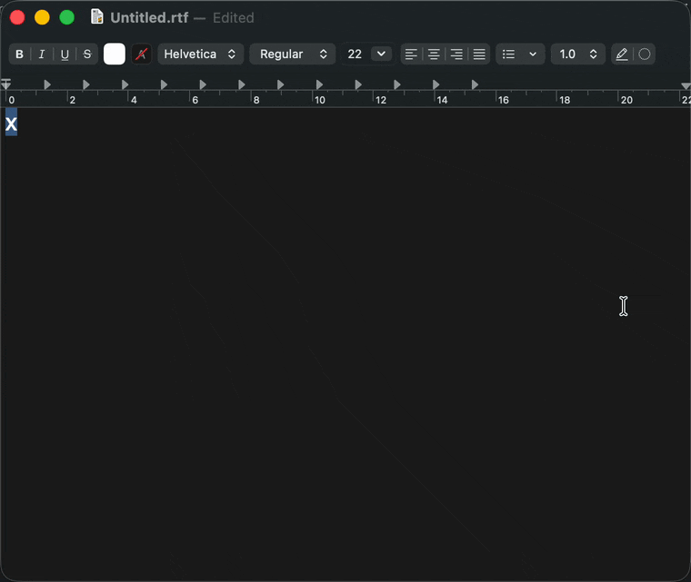
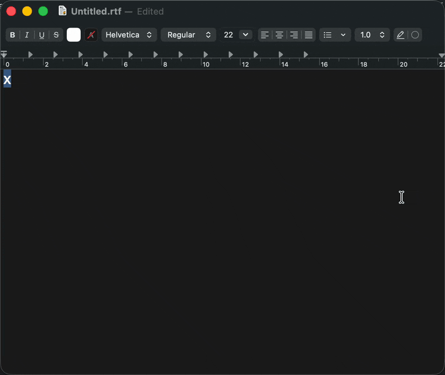
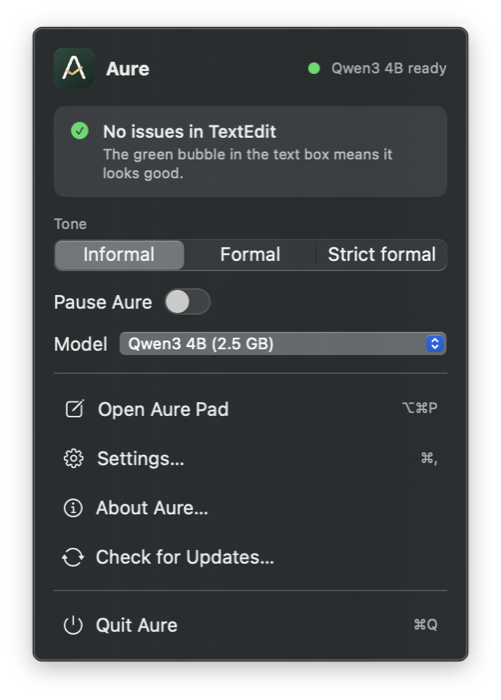

<p align="center">
  
</p>

# Aure

**Your words. Your Mac. Your call.**

Aure is a local grammar and tone assistant for macOS. It runs a language model on your Mac, suggests corrections, and lets you decide what to keep. Write in Aure Pad or review suggestions in other apps through macOS Accessibility—without sending your text to a cloud inference service.

[Download](#install) · [Build from source](#build-from-source) · [Privacy](#privacy-and-offline-use) · [Contribute](CONTRIBUTING.md) · [Report a bug](https://github.com/tiagocolombo/aure/issues)

**Early development:** app integrations and model quality are still being tested. Google Docs support is experimental, not a promise of reliable document editing. Keep a copy of important writing and review every replacement.

## See it in action

<p align="center">
  
</p>

**Grammar fixes in any app.** Type as usual. The red bubble counts errors, and the card shows every fix before anything changes.

<p align="center">
  
</p>

**Plainer writing.** When text reads like generic AI output (buzzwords, hype, em dashes), the yellow card says so and offers a plainer alternative. Nothing changes until you apply it.

<p align="center">
  
</p>

Recorded with Qwen3 4B on an Apple Silicon Mac. Suggestions come from the model, so your results will vary.

## Why Aure?

- **Local inference.** Download a model once, then check your writing offline.
- **You approve the edits.** Review proposed changes instead of silently rewriting your text.
- **Corrections and style stay separate.** Grammar fixes take priority; broader writing alternatives are optional.
- **A native Mac app.** A menu bar companion and a built-in writing pad, with no cloud account needed for inference.

## What works today

- Aure Pad: paste or type text, check grammar, request a rewrite, review a diff, accept or dismiss edits, and copy the result.
- Informal, formal, and strict formal tone presets, with editable descriptions and US/Canadian English settings.
- A menu bar app with pause controls, model status, and a suggestion bubble for accessible text fields in other apps.
- Red bubbles indicate grammar corrections; yellow bubbles indicate optional model-generated writing alternatives when no corrections remain. The popup separates the two and lets you preview, apply, or dismiss suggestions. Automatic writing alternatives are currently limited to text up to 1,200 UTF-16 units.
- A "Sounds AI-written" label when the model judges text to read like generic AI output. Rewrites prefer plain words, and em dashes are blocked during generation. The judgment is the model's, not a detector you can rely on.
- In-app updates: Aure can check GitHub Releases once a day, notify you, and install a new version from the menu bar or Settings.
- Local GGUF inference through [llama.cpp](https://github.com/ggml-org/llama.cpp), with Metal on Apple Silicon and CPU inference on Intel.
- Model downloads with checksum verification, model switching, and local GGUF import. An imported model must be compatible with the runtime and prompting; importing a file does not guarantee useful corrections.
- Models you already downloaded with LM Studio, Ollama, llama.cpp (`-hf` cache), the Hugging Face cache, Jan, or GPT4All appear under **Settings → Models → From other apps on this Mac** and are used in place, without copying. Aure's prompts are tuned and evaluated on the Qwen3 models in its catalog; other models may fix fewer errors or change correct text. Extra folders can be added with `AURE_EXTRA_MODEL_DIRS` (colon-separated).

Aure uses Accessibility for cross-app checking. Compatibility depends on what each app exposes, so Slack, browser editors, rich text fields, and different app versions can behave differently. If reading or replacement fails, use Aure Pad and copy the result manually. Google Docs' canvas-based editor is a particular limitation: treat any Docs integration as experimental and test only on a disposable document first. See the [Google Docs setup and verification guide](docs/GOOGLE_DOCS.md).

A dedicated Chrome extension/native messaging bridge, a guided voice-profile assistant, and learning from accepted or dismissed edits are roadmap items, not shipped features.

## Install

1. Download `Aure-<version>.dmg` from the [latest release](https://github.com/tiagocolombo/aure/releases/latest) and drag Aure into Applications. The app is universal (Apple Silicon and Intel) and needs macOS 14 or newer.
2. Right-click Aure in Applications, choose **Open**, then **Open** again. Releases are signed with a self-signed certificate and are not yet notarized by Apple, so macOS asks this once.
3. Pick a model in the setup window, and grant Accessibility when asked so Aure can check other apps.

A new release is published after every change merged into `main`. On its second launch Aure asks whether to check for updates automatically; you can change that under **Settings → General → Updates**. Updates are verified with an EdDSA signature before they are installed.

## Build from source

You need:

- macOS 14 Sonoma or newer.
- Apple's Swift 6 toolchain (Xcode 16+ or compatible Command Line Tools), with the macOS SDK selected through `xcode-select`.
- Git and CMake. If you use Homebrew, `brew install cmake` installs CMake.
- Internet access to fetch llama.cpp and download a model, plus disk space for build output and model weights.

Apple Silicon is the preferred development target. The scripts also include an Intel CPU build path; its performance and app compatibility need separate testing. Model size, memory use, and latency vary by hardware and input length. Catalog downloads range from roughly 0.5 GB to 3 GB; inference needs additional memory.

From the repository root:

```sh
git clone https://github.com/tiagocolombo/aure.git
cd aure

# Fetch the pinned llama.cpp source and build for this Mac.
AURE_ARCHS=native scripts/build-llama.sh

# Build and sign the app for local use.
AURE_ARCHS=native scripts/build-app.sh release
open build/Aure.app
```

The build embeds `llama-server` when `build/llama/llama-server` exists. Build the helper first. The scripts use Swift Package Manager; no generated Xcode project is required.

### Your first check

1. Choose a model in onboarding or **Settings → Models**, download it, and wait for the engine to become ready.
2. Open Aure Pad and try a short, disposable example such as `She go to school every day.`
3. Run a grammar check, review the proposed diff, and accept or dismiss the edits. Model output can vary; this is a walkthrough, not a guaranteed correction.
4. To check other apps, grant Aure permission in **System Settings → Privacy & Security → Accessibility**, then focus a supported text field. If reading or replacement fails, return to Pad and copy the result manually.

### Signing and local packaging

By default, builds use an existing `Aure Local` signing identity or fall back to ad-hoc signing. Ad-hoc rebuilds may require granting Accessibility permission again.

Optionally run `scripts/bootstrap.sh` before building. It creates and trusts a self-signed code-signing identity in your login keychain and may prompt for approval. This changes your keychain; it is not required to compile the app and does not notarize it with Apple.

To build both architecture slices and create a local DMG:

```sh
scripts/build-llama.sh
scripts/build-app.sh release
AURE_SKIP_BUILD=1 scripts/make-dmg.sh
```

The output is `dist/Aure-<version>.dmg`. These are local development packages, not notarized releases. macOS may block an unnotarized downloaded build; only approve software you built or trust. A locally generated DMG is not evidence of testing on another Mac.

The optional Nix setup currently depends on a private development-shell repository. Public contributors should use the scripts above rather than `nix develop` or the maintainer's `dev` CLI.

## Privacy and offline use

After installing the runtime and downloading or importing a model, grammar inference runs locally. The app launches `llama-server` on `127.0.0.1` with a per-process API key; the current app does not use a cloud inference provider. Model downloads contact Hugging Face and its download infrastructure.

Offline inference does **not** make the app you are writing in offline. Google Docs, Slack, browser pages, clipboard managers, and other software may transmit or retain their own copies of your writing.

- Cross-app checking reads focused text through Accessibility. The code skips recognized secure text fields and a built-in list of password managers, terminals, and code editors; that list is not a universal sensitive-data detector. Pause checking when needed.
- Replacement may temporarily place corrected text on the system clipboard, then restore the previous contents. Clipboard-monitoring software can still observe it.
- If you allow update checks, Aure downloads `appcast.xml` from GitHub Releases once a day. The request carries the app version and no writing or system profile.
- Models live in `~/Library/Application Support/Aure/Models/`. Preferences use macOS UserDefaults. The inference process writes a local diagnostic log at `~/Library/Logs/Aure/llama-server.log`, and the app logs actions (never your text) to `~/Library/Logs/Aure/aure.log`.
- Do not publish raw logs, screenshots, or evaluation output without reviewing them for private text and local paths.

## Model limitations

Aure is a suggestion tool, not an authority on correctness. Models can miss errors, change meaning, or make unnecessary edits to correct text. Tone rewrites intentionally permit broader changes. A green status means no suggestions were surfaced, not that the text is error-free.

Confidence-based filtering is experimental. Token probabilities are not calibrated probabilities that an edit is grammatically correct. Smaller models can be faster but less useful; larger models can still be wrong and may be slow on Intel. English is the current focus.

[Model evaluation notes](docs/MODEL_EVAL.md) record development experiments, not an independent benchmark or product accuracy guarantee. Different scripts, datasets, prompts, filters, and scoring definitions are not directly comparable. Do not interpret catalog percentages or a small golden set as general accuracy claims.

## Development

```sh
scripts/test.sh
scripts/lint.sh

# Native debug build and launch (stops any running Aure first).
scripts/run-app.sh
```

Unit tests do not require a model download. Real-model evaluations require a running local server and separate model weights; see `Packages/AureKit/Sources/AureEval/main.swift` for supported CLI arguments. No benchmark score substitutes for manual integration testing.

| Path | Purpose |
| --- | --- |
| `Packages/AureKit/Sources/AureCore` | Requests, prompts, parsing, diffs, and edit confidence |
| `Packages/AureKit/Sources/AureInference` | Local server lifecycle and correction pipeline |
| `Packages/AureKit/Sources/AureModels` | Catalog, downloads, and imports |
| `Packages/AureKit/Sources/AureAccessibility` | Focus tracking and text replacement |
| `Packages/AureKit/Sources/AureUI` | Menu bar, Pad, settings, and suggestion UI |
| `eval/` | Evaluation scripts and test cases |
| `scripts/` | Build, signing, test, and packaging commands |

See [CONTRIBUTING.md](CONTRIBUTING.md) for tests, bug reports, and contribution guidelines.

## License

Aure's original source and the original SVG logo are available under the [MIT License](LICENSE). Third-party runtime code, models, and evaluation datasets retain their own licenses. The model catalog records license identifiers, but you should check each upstream model's terms before using or redistributing its weights. Packaging llama.cpp also requires preserving its applicable license notices; Aure's license does not replace them.
